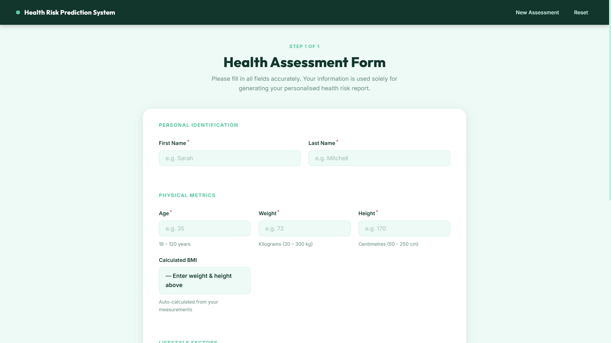
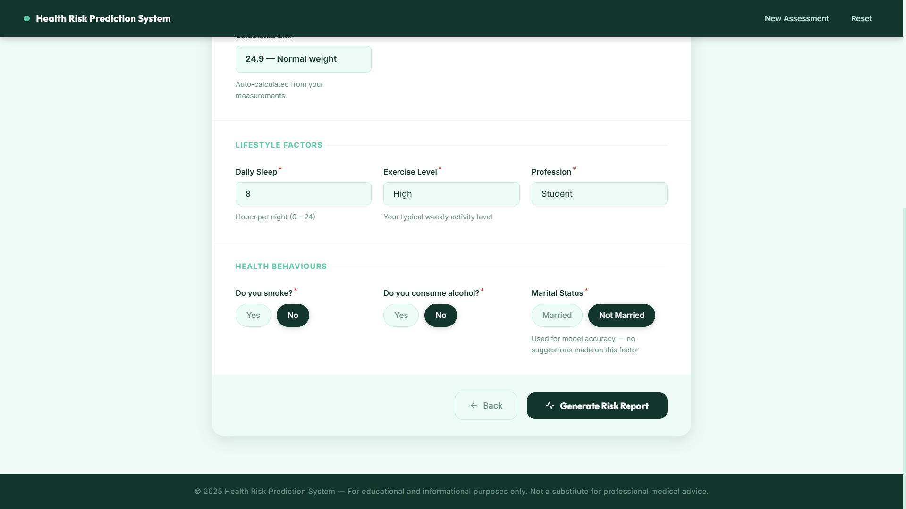
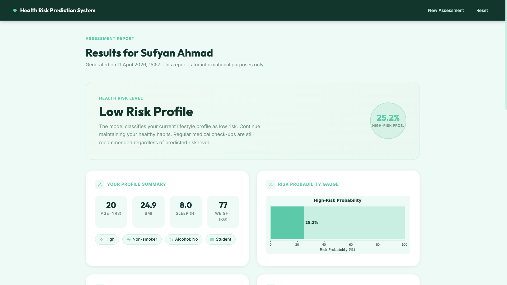
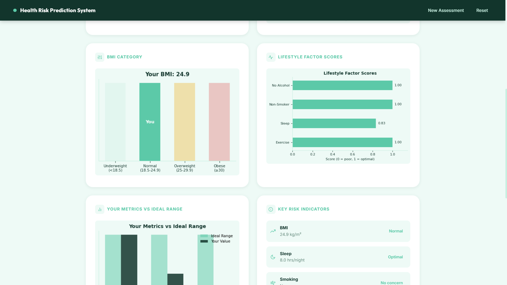
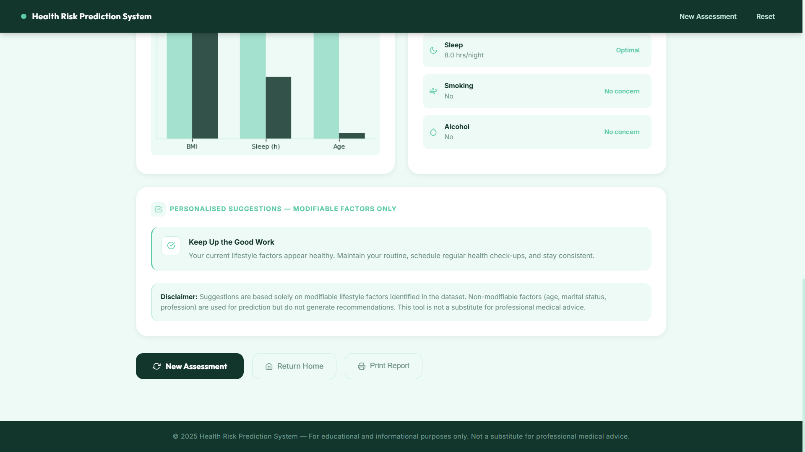

# 💚 Health Level Prediction System

A machine-learning-powered web application that predicts a user's **health risk level** (Low / Medium / High) based on lifestyle inputs such as age, BMI, sleep, exercise, smoking, and profession. Generates a detailed visual report with charts.

---

## 📸 Screenshots

### Welcome Screen


### Input Form (Page 1)


### Input Form (Page 2)


### Results Report


### Detailed Report (continued)



---

## 🛠 Tech Stack

| Component     | Technology                                          |
|---------------|-----------------------------------------------------|
| Backend       | Python, Flask                                       |
| ML Model      | scikit-learn — Random Forest Classifier             |
| Data          | Synthetic lifestyle/health dataset (CSV, ~270K rows)|
| Preprocessing | StandardScaler, LabelEncoder, One-Hot Encoding      |
| Charts        | Matplotlib (base64-encoded PNGs served inline)      |
| Frontend      | Jinja2 HTML templates, custom CSS                   |
| Persistence   | Flask session, joblib model serialisation           |

---

## 🧠 Core Concepts

### Machine Learning Pipeline
1. **Dataset** — `Lifestyle_and_Health_Risk_Prediction_Synthetic_Dataset.csv` with features: age, weight, height, BMI, sleep, exercise type, smoking, alcohol, marital status, profession.
2. **Preprocessing** — missing value imputation, label encoding for binary columns, one-hot encoding for categorical columns (exercise, profession).
3. **Model** — `RandomForestClassifier` trained and saved to `model/rf_model.pkl` via `joblib`.
4. **Scaler** — `StandardScaler` saved to `model/scaler.pkl` to normalise inference inputs.
5. **Label Encoder** — `le_risk.pkl` maps numeric predictions back to Low / Medium / High labels.
6. **Mappings** — `mappings.pkl` stores encoding dictionaries for categorical inputs.

### Report Generation
- After prediction, Matplotlib generates multiple inline charts (risk gauge, feature breakdown, comparison bars).
- Charts are converted to **base64 PNG strings** and passed to the Jinja2 template — no file writes, no temp files.
- Results page provides a full health report with personalised insights.

### Session-Based State
- Flask `session` stores the user's form inputs and prediction result across the multi-page form flow.
- No database required — fully stateless between sessions.

---

## 📁 File Hierarchy

```
health-level-prediction-system/
│
├── app.py                  # Flask app — routes, prediction logic, chart generation
├── train_model.py          # Training script — run once to generate model files
├── main.py                 # App entry point / runner
│
├── model/                  # Serialised ML artefacts (generated by train_model.py)
│   ├── rf_model.pkl        # Trained Random Forest model
│   ├── scaler.pkl          # StandardScaler
│   ├── feature_columns.pkl # Ordered feature list for inference
│   ├── le_risk.pkl         # LabelEncoder for risk level
│   └── mappings.pkl        # Encoding maps for categorical inputs
│
├── Lifestyle_and_Health_Risk_Prediction_Synthetic_Dataset.csv
│
├── project_final.ipynb     # Jupyter notebook — EDA + model experiments
│
├── templates/
│   ├── base.html           # Base layout
│   ├── welcome.html        # Landing / intro page
│   ├── form.html           # Multi-section input form
│   └── results.html        # Prediction report with embedded charts
│
├── static/
│   └── css/
│       └── style.css       # Custom styles (green colour palette)
│
└── screenshots/
```

---

## 🔌 Flask Routes

| Method | Route       | Description                                   |
|--------|-------------|-----------------------------------------------|
| GET    | `/`         | Welcome / landing page                        |
| GET    | `/form`     | Render lifestyle input form                   |
| POST   | `/predict`  | Process form, run model, redirect to results  |
| GET    | `/results`  | Show prediction report with charts            |

---

## ⚙️ Setup & Run

### 1. Install dependencies
```bash
pip install flask scikit-learn pandas numpy matplotlib joblib
```

### 2. Train the model (first time only)
```bash
python train_model.py
```
This generates all files in the `model/` directory.

### 3. Run the app
```bash
python app.py
# or
python main.py
```
Visit `http://localhost:5000`

---

## 🎨 Colour Palette

```python
PALETTE = {
    "lightest": "#EEFAF6",
    "light":    "#C8EFE1",
    "mid":      "#5CC9A8",
    "dark":     "#12352C",
}
```
